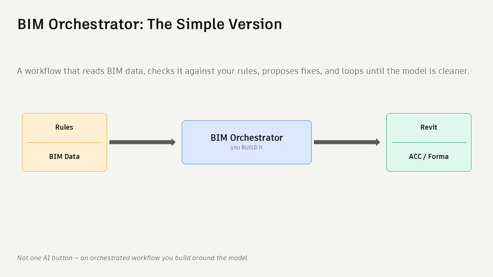
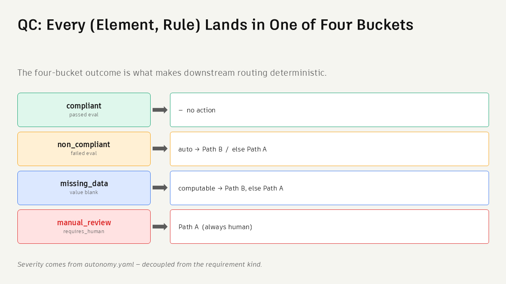
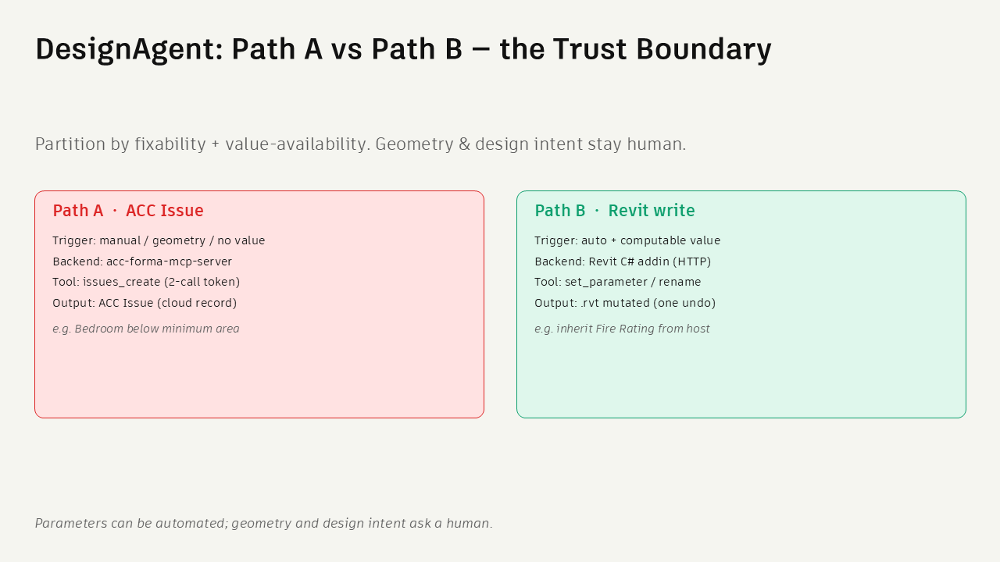
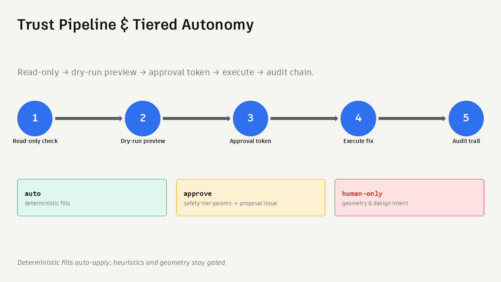
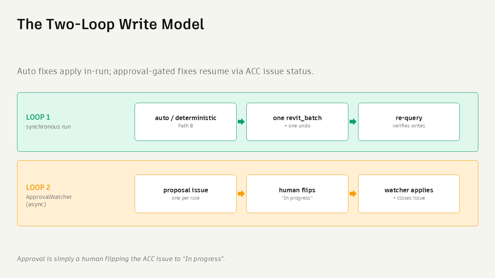
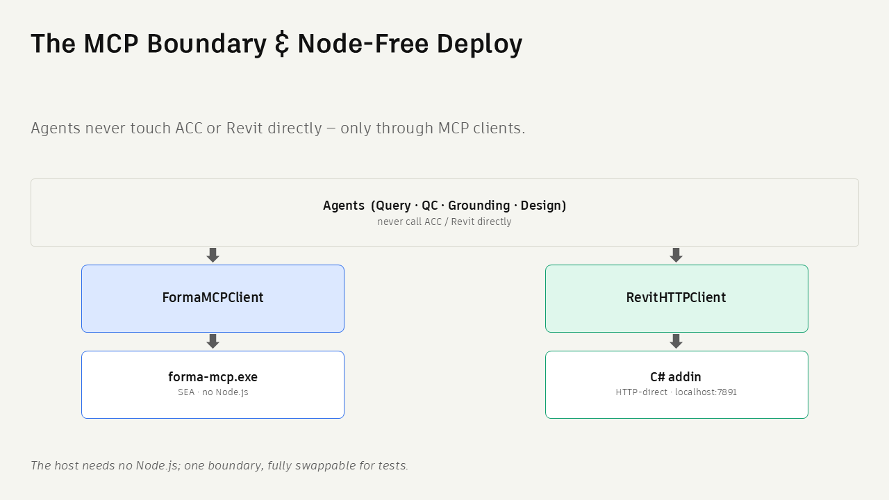

# Why This Solution

Short version of the design rationale: what AutoAudit refuses to do, and why
those refusals are the product. For a BIM manager or developer who has read the
[README](../README.md) and wants the reasoning in five minutes. The exact
contracts live in [ARCHITECTURE.md](ARCHITECTURE.md) — this page is the argument,
not the specification.

*Read the model, check it against your rules, propose fixes, loop.*

---

## The bet: deterministic, because "audit" means reproducible

The decision that shapes everything else is what sits **inside** the
check-and-fix loop. There is no language model in it. Every compliance verdict
and every fix value is produced by plain code reading plain data.

The alternative — one clever agent that reads the model and fixes what looks
wrong — fails the only requirement that matters here. A regulated deliverable
needs an answer you can re-run next month for the same result, point at the rule
that fired, name the element, and defend to a reviewer who was not in the room.
"The AI changed 300 parameters and we are fairly confident it was right" is not
an audit. It is a liability.

Determinism buys three things at once: same input, same output; you can read the
branch that fired; and the engine is testable offline with no model open and no
API key. It costs something too — a deterministic engine can only check what its
primitives express, and it says so out loud rather than guessing (see
[the limits](#what-it-deliberately-does-not-do)).

---

## Four buckets, because pass/fail throws away the routing

*Every (element, rule) pair lands in one bucket, and the bucket decides the route.*

Every element-rule pair resolves to one of four outcomes: **compliant**,
**non-compliant**, **missing data**, or **manual review**. The one that earns its
keep is **missing data**. A two-way pass/fail forces a blank value into a lie:
call it a pass and the model ships with an unchecked element a report now claims
is fine; call it a failure and the real violations drown in noise from a field
nobody has filled in yet. The honest answer is "this check could not see a
value" — a different state with a different remedy, since the value is sometimes
derivable from elsewhere and sometimes not.

**Manual review** applies the same honesty to judgment. Some code language is
deliberately not mechanical — *approved by the building official*, *habitable* —
and the engine hands those over intact rather than inventing a threshold to look
thorough. Four buckets is the smallest set that keeps routing deterministic.

---

## Path A and Path B: the boundary is "is there exactly one right answer"

*Parameters can be automated. Geometry and design intent ask a human.*

**Path B** writes back into the model — a parameter value, a rename. It is
available only when the correct value is *deterministically computable*: a door
inheriting the fire rating of the wall that hosts it, a name snapped to the
canonical form the naming rule already declares. One input, one derivation, one
answer.

**Path A** raises an ACC issue and stops. It states what is wrong, why, and which
clause it came from, then waits for a person. It covers anything where the fix is
a judgment (a bedroom below minimum area — enlarging it is a *design* decision,
not a data edit), anything geometric, and anything where the engine can compute
no value at all.

The boundary is not severity and not category — it is availability of a single
correct answer. Where the autofill layer cannot produce an exact value it must
return nothing, and nothing routes to a human. The engine never fabricates data:
a plausible wrong number is the most dangerous output a tool like this can
produce, because it looks finished and gets trusted.

---

## Writes are gated by default, not by option

*Read-only check, dry-run preview, approval token, execute, audit trail.*

Even on Path B, a computed value does not simply land. Every write passes five
stages: read-only check, dry-run preview, an approval token, execute only the
previewed fix, append to a tamper-evident audit chain.

*Deterministic fills apply in-run; everything else parks until a human approves.*

Approval is a default rather than a setting because of what the failure looks
like when you get it wrong: an automated write on a live model is irreversible in
practice even when technically undoable, since by the time anyone notices the
model has moved on. The gate is on unless a rule class is explicitly cleared for
it, not off until someone remembers to turn it on.

Two mechanics keep the gate usable. Writes batch into a **single undoable
transaction**, so a reviewer who disagrees reverts a whole run in one action
instead of 300. And proposals group **one issue per rule**, listing every element
that rule touched: a per-element flood is unreviewable, one combined issue mixes
unrelated problems, and one rule is the natural unit a person approves or
rejects. Approval itself is deliberately boring — a human moves the ACC issue to
*In progress*, a watcher applies the parked writes and closes it.

---

## Rules are data, and the model only drafts them

A rule is a YAML declaration — scope, check, severity, action — evaluated by a
fixed vocabulary of requirement types, catalogued in
[RULE_CAPABILITY_CATALOG.md](RULE_CAPABILITY_CATALOG.md). Rules live in
configuration because the people who own the standards are BIM managers, not
Python developers, and because standards change far more often than an engine
does. A new check is a data edit: reviewable in a pull request, no recompile, no
way to break the engine while adding one. Code tables work the same way — a
building code is versioned and regional, so the required-value table for a
jurisdiction is a YAML file you swap, and the *check* and the *fix* read the same
file, so they cannot drift apart.

A language model does appear, in exactly one place: turning your sentence into a
draft rule. That draft is grounded in the real parameter catalog probed from
Revit, so it cannot bind to a parameter that does not exist on the category or
nominate a read-only field as a write target; it is then validated against the
schema, and a human reads it. The model drafts. It never holds the pen over your
model, and nothing it produces reaches the check loop without passing the same
deterministic validation as a hand-written rule.

---

## One boundary to the outside world

*Agents reach ACC and Revit only through MCP clients.*

No agent talks to Revit or ACC directly. Every call goes through an MCP client,
and that one rule pays off three times: agents cannot do anything the MCP surface
does not expose (security), the client swaps for a protocol-identical mock so the
same agent code runs in tests and in production (testing), and the host needs no
extra toolchain for either backend (deployment).

---

## What it deliberately does not do

Some valuable checks need primitives this engine does not have yet, and are
listed as gaps rather than faked.

- **Aggregation and ratios** — occupant load, fixture counts, ventilation rates.
  These need a count-and-divide operator across a set of elements.
- **Path of travel** — egress distance and common path need a navigable-graph
  distance engine, not a parameter read.
- **Boolean composition** — thresholds conditional on more than one clause.
- **Judgment language** — anything a code phrases as a human decision stays in
  manual review permanently, by design.

A tool that quietly skips what it cannot check, or guesses at it, is worse than
one that says a human is needed. The gap list is also the roadmap.

---

## Want the full story?

[ARCHITECTURE.md](ARCHITECTURE.md) has the detailed contracts: the state object,
the router and its convergence rule, the agent responsibilities, the requirement
vocabulary and the write pipeline in full. Alongside it,
[RULE_CAPABILITY_CATALOG.md](RULE_CAPABILITY_CATALOG.md) covers what the rule
language expresses, [the changelog](../bim-orchestrator/CHANGELOG.md) how it got
here, and [SECURITY.md](../SECURITY.md) the reporting policy.
